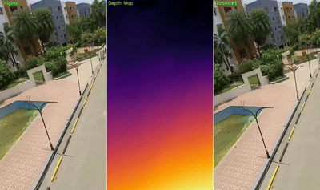
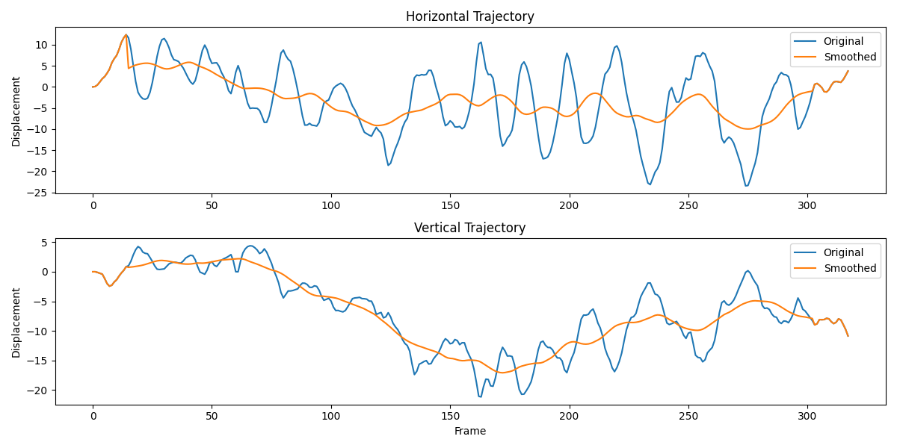

# MiFlow: Depth-Enhanced Video Stabilization

MiFlow is a Python Framework for video stabilization that combines optical flow with depth estimation using MiDaS to achieve smoother and more natural stabilization results. 

## Demo
<p align="center">
  
  
</p>

## Paper

Our work was accepted at CVMI 2025. You can read the paper [here](assets/Flowdepthformer.pdf).

**Note**: This paper was accepted but not presented at the conference, and therefore was not officially published in the proceedings.

## Features

- Video stabilization using optical flow
- Depth-enhanced motion estimation (using MiDaS depth model)
- Transformer-based trajectory smoothing
- Customizable smoothing parameters
- Live preview during processing
- Trajectory visualization
- Command-line interface

## Installation

### Prerequisites

- Python 3.7+
- OpenCV
- PyTorch
- Other dependencies listed in requirements.txt

### Option 1: Install from GitHub

```bash
# Clone the repository
git clone https://github.com/Bhavisha-06/miflow.git
cd miflow

# Install dependencies
pip install -r requirements.txt

# Install the package in development mode
pip install -e .
```

### Option 2: Install as a package

```bash
pip install git+https://github.com/Bhavisha-06/miflow.git
```

## Usage

### Command-Line Interface

```bash
# Basic usage
miflow input_video.mp4 -o output_video.mp4

# Without depth estimation (faster but less accurate)
miflow input_video.mp4 --no-depth

# With preview
miflow input_video.mp4 --preview

# With trajectory plotting
miflow input_video.mp4 --plot

# Full options
miflow input_video.mp4 -o output_video.mp4 --crop-ratio 0.9 --depth-beta 0.7 --preview --plot
```

### Python API

```python
from miflow import MiFlow

# Initialize the stabilizer
stabilizer = MiFlow(
    use_depth=True,           # Use depth information
    crop_ratio=0.9,           # Crop ratio to remove borders
    depth_beta=0.7,           # Depth weighting factor
    transformer_layers=2,     # Number of transformer layers
    transformer_heads=2,      # Number of attention heads
    transformer_dim=32,       # Transformer dimension
    verbose=True              # Print progress information
)

# Process video
stabilizer.process_video(
    input_path="input_video.mp4",
    output_path="stabilized_video.mp4",
    preview=True              # Show preview during processing
)

# Plot trajectories
stabilizer.plot_trajectories("trajectories.png")
```

## Parameters

**use_depth**: Whether to use depth information for stabilization (default: True)
**depth_beta**: Weighting factor for depth-based flow weighting (default: 0.7)
**transformer_layers**: Number of transformer encoder layers for trajectory smoothing (default: 2)
**transformer_heads**: Number of attention heads in transformer (default: 2)
**transformer_dim**: Dimension of transformer model (default: 32)
**midas_weights_path**: Path to custom MiDaS model weights (default: None - use built-in weights)
**verbose**: Print progress information (default: False)

## Examples

### Basic stabilization

```bash
miflow shaky_video.mp4 -o stable_video.mp4
```

### Fast mode (without depth)

```bash
miflow shaky_video.mp4 -o stable_video.mp4 --no-depth
```

### Interactive mode with visualization

```bash
miflow shaky_video.mp4 -o stable_video.mp4 --preview --plot
```

## Algorithm

MiFlow works in two passes:

1. **Motion Analysis**:
   - Calculate optical flow between consecutive frames using Farneback method
   - Weight motion vectors by depth information (if enabled)
   - Construct trajectory of camera movement

2. **Stabilization**:
   - Apply Transformer-based temporal smoothing to trajectory
   - Generate transformation matrices
   - Apply transformations to frames
   - Crop borders to remove empty regions

## License

This project is licensed under the MIT License - see the LICENSE file for details.

## Citation

## Citation

If you use **MiFlow** in your research, please cite the following:

```
@misc{miflow2023,
title = {MiFlow: Combining MiDaS Depth and Optical Flow for Enhanced Video Stabilization},
author = Bhavisha Narendra Chaudhari, Adarsh Jha
year = {2025},
howpublished = {\url{https://github.com/Bhavisha-06/miflow}},
note = {Accessed: YYYY-MM-DD}
}
```

## Acknowledgments

- MiDaS depth estimation model from Intel
- OpenCV for image processing and optical flow
